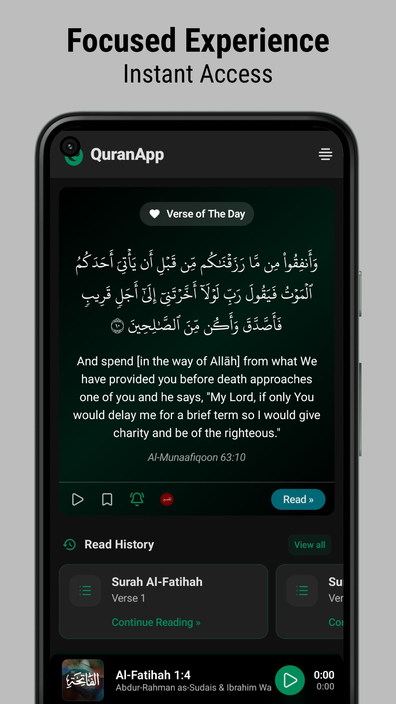
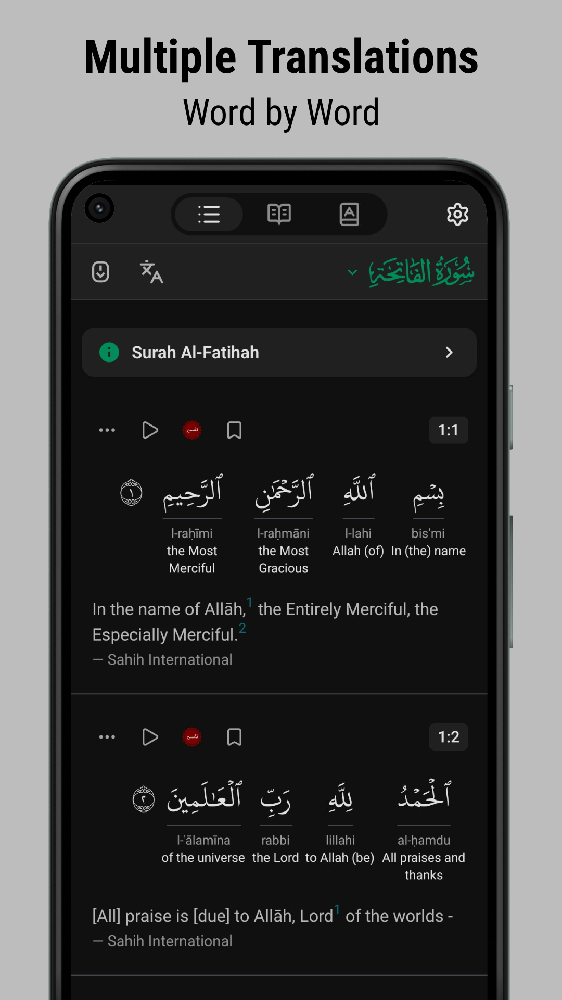
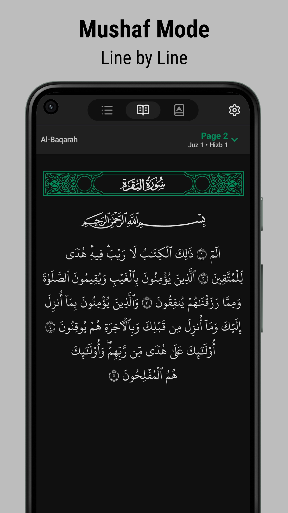
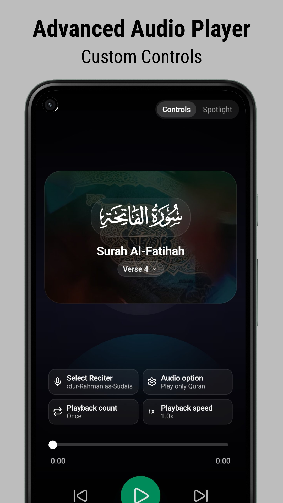
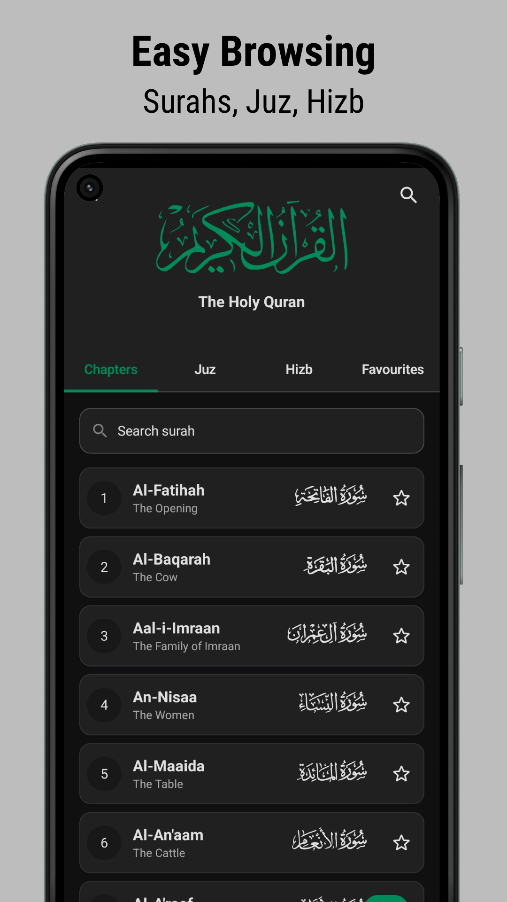

### QuranApp: Read and Explore

The QuranApp is an ad-free and privacy-focused mobile application that facilitates reading and exploring the Holy Qur’an on daily basis at any time and place.

The discord server is the primary communication channel for any kind of discussion and it is supervised by the developers.

Table of content

- [Screenshots](#screenshots)
- Features
  - [Highlights](#features)
  - [All features](/FEATURES.md)
- [Credits](#credits)
- Contribute
  - [Contributing](#contributing)
  - [Contributors](/CONTRIBUTORS.md)
- [Wiki](https://github.com/AlfaazPlus/QuranApp/wiki)
- [Roadmap](https://github.com/AlfaazPlus/QuranApp/wiki/Roadmap)
- [License](/LICENSE)

## Screenshots

      
      
      
      
      
  

## Features

| Salient Features               |     |
|--------------------------------|-----|
| 🚫 No Ads or Purchases         | ✅   |
| 🛡️ No permission required *     | ✅   |
| 📙 Multiple Translations       | ✅   |
| 🎙️ Multiple Recitations       | ✅   |
| 🎨 Multiple Quran Fonts        | ✅   |
| ❤️ Verse Reminder               | ✅   |
| 🔗 Advanced Verse Interlinking | ✅   |
| ⚡ Many more...                 | ✅   |
      
_* Permissions that affect your privacy such as storage, gps, camera etc. are not required._
      
See an overview of all the features [here](/FEATURES.md).

If you want help with using the QuranApp, please take a look at [WiKi](https://github.com/AlfaazPlus/QuranApp/wiki).

## Credits
Data:
- [QuranEnc](https://quranenc.com/en/home)
- [Tanzil](https://tanzil.net/)
- [quran.com](https://quran.com/)
- [quran-data-noorehuda](https://codeberg.org/Luciogi/quran-data-noorehuda)

Fonts:
- [KFQPC font](https://github.com/mustafa0x/qpc-fonts) belongs to [King Fahd Quran Complex](https://qurancomplex.gov.sa/)
- [Noorehuda](http://www.noorehidayat.org/)
  
Quran recitations:
- [everyayah.com](https://everyayah.com/)
- [quran.com](https://quran.com/)

See [this page](/CONTRIBUTORS.md) to know about the contributors.

## Contributing

If you want to contribute, kindly visit [CONTRIBUTING.md](/CONTRIBUTING.md) to learn the ways to get started.

## App Translations
App translations are hosted at Weblate. If you want to translate the app in your language, you may visit [here](https://hosted.weblate.org/projects/QuranApp)

 

## License

