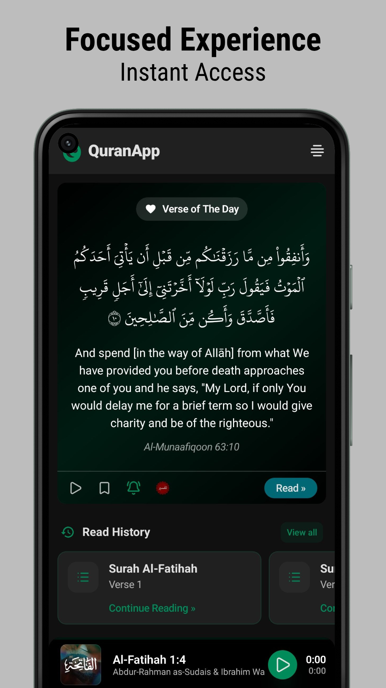
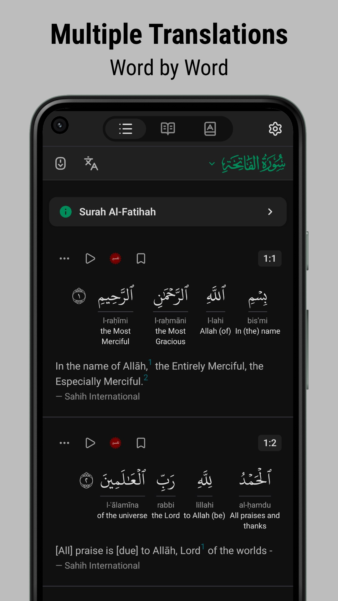
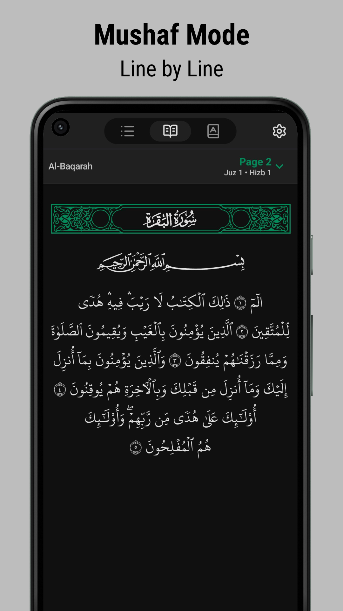
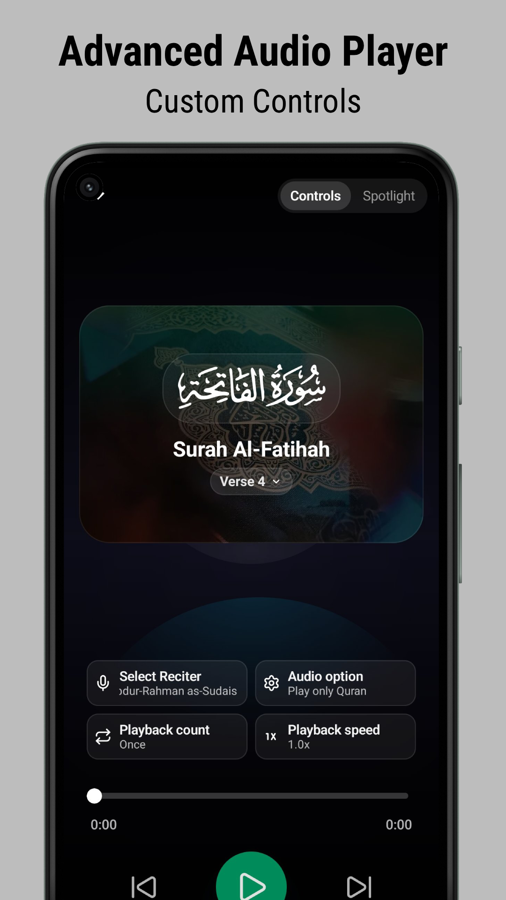
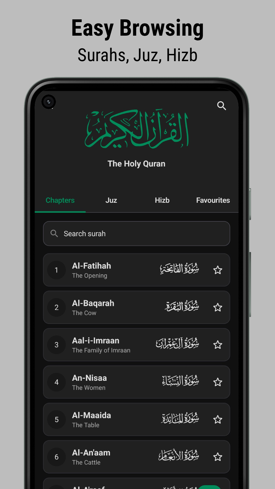
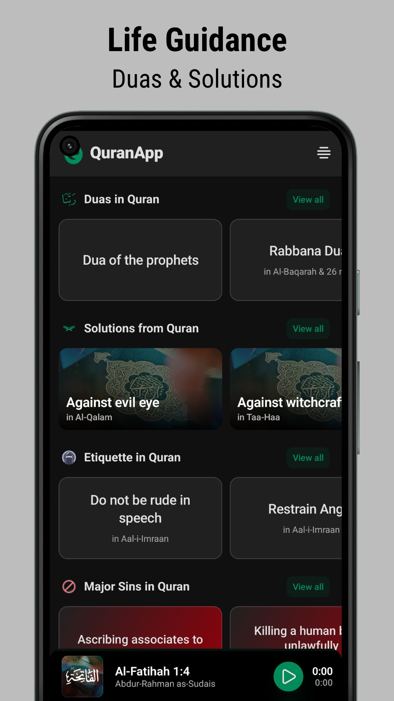
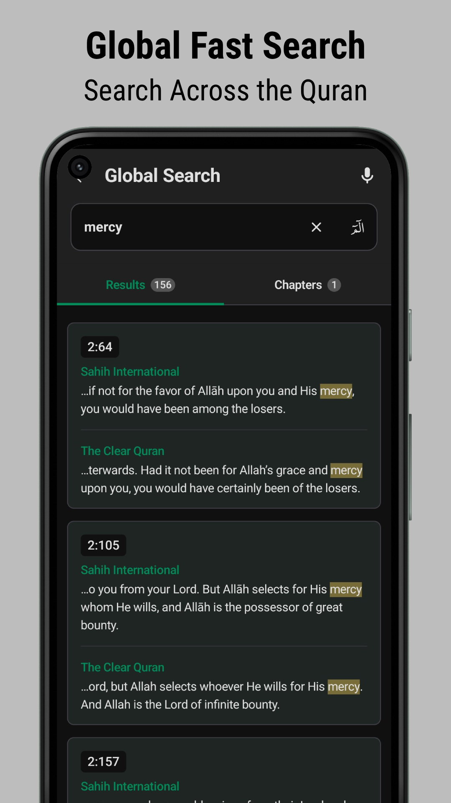
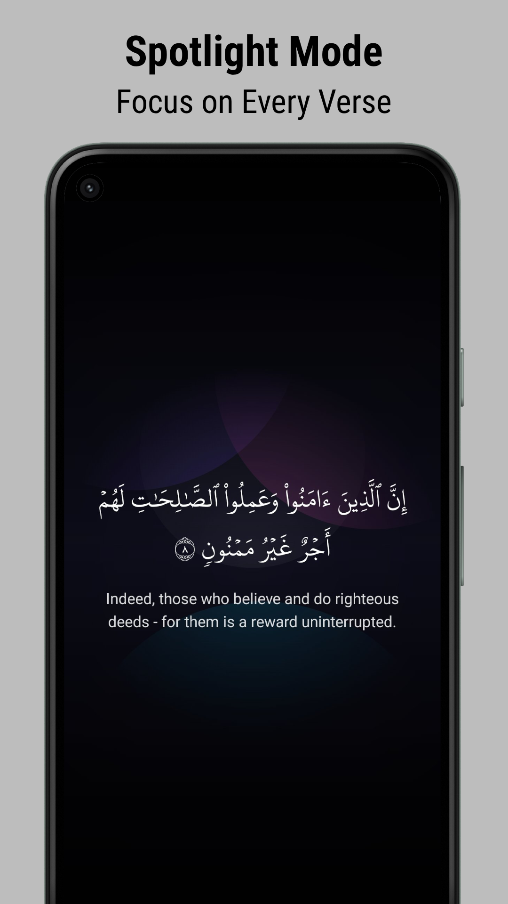

### QuranApp: Read and Explore

The QuranApp is an ad-free and privacy-focused mobile application that facilitates reading and exploring the Holy Qur’an on daily basis at any time and place.

**Download QuranApp:**

**Join the community:**

**Check out more apps:**

**[SunnahApp](https://github.com/AlfaazPlus/SunnahApp)**

Table of Contents

- [Screenshots](#screenshots)
- Features
    - [Highlights](#features)
    - [All features](/FEATURES.md)
- [Credits](#credits)
- Contribute
    - [Contributing](#contributing)
    - [Contributors](/CONTRIBUTORS.md)
- [License](/LICENSE)

## Screenshots

      
      
      
      

      
      
      
      

## Features

| Salient Features                           |     |
|--------------------------------------------|-----|
| 🚫 No Ads or Purchases                     | ✅   |
| 🛡️ No permission required *               | ✅   |
| 📙 Multiple Translations and Tafsirs       | ✅   |
| 🎙️ Multiple Recitations with Translations | ✅   |
| 🔤 Multiple Quran Fonts                    | ✅   |
| 📄 Mushaf Mode                             | ✅   |
| 🎨 Material Colors                         | ✅   |
| ❤️ Verse Reminder                          | ✅   |
| ⚡ [Many more...](/FEATURES.md)             | ✅   |

_* Permissions that affect your privacy such as storage, gps, camera etc. are not required._

See an overview of all the features [here](/FEATURES.md).

## Credits

- [QuranEnc](https://quranenc.com/en/home)
- [Tanzil](https://tanzil.net/)
- [quran.com](https://quran.com/)
- [quran-data-noorehuda](https://codeberg.org/Luciogi/quran-data-noorehuda)
- [Noorehuda](http://www.noorehidayat.org/)
- [qurandb.com](https://qurandb.com)
- [tarteel.ai](https://tarteel.ai)
- [quranicaudio.com](https://quranicaudio.com)
- [everyayah.com](https://everyayah.com/)

See [this page](/CONTRIBUTORS.md) to know about the contributors.

## Contributing

If you want to contribute, kindly visit [CONTRIBUTING.md](/CONTRIBUTING.md) to learn the ways to get started. For a more comprehensive guide to the codebase, please refer to the [DeepWiki documentation](https://deepwiki.com/AlfaazPlus/QuranApp).

## App Translations
App translations are hosted at Weblate. If you want to translate the app in your language, you may visit [here](https://hosted.weblate.org/projects/QuranApp)

 

## License

